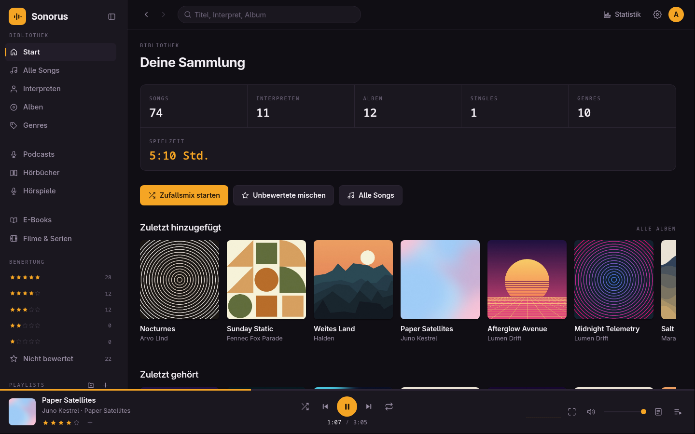

# Sonorus für Linux

Desktop-Client für [Sonorus](https://github.com/flopsyan/sonorus), den selbst
gehosteten Mediaplayer: die Web-App in einem eigenen Fenster, mit Eintrag im
Anwendungsmenü und Medientasten. Der Client braucht einen laufenden
Sonorus-Server.



## Funktionen

- Alles, was die Web-App kann, ohne Browser drumherum.
- **Medientasten** für Wiedergabe, Weiter und Zurück, auch bei Filmen und
  Hörbüchern.
- Links auf andere Seiten öffnen sich im normalen Browser.
- Serveradresse und Fenstergröße werden gemerkt.

Downloads und Offline-Wiedergabe gibt es nur in der
[Android-App](https://github.com/flopsyan/sonorus-android).

## Installation

Gebaut wird mit Node.js und npm:

```bash
npm install
npm run dist
```

In `dist/` liegen danach ein AppImage, ein `.deb`, ein `.pacman` und ein
`.tar.gz`, zum Beispiel:

```bash
sudo pacman -U dist/sonorus-linux-<version>.pacman            # Arch
sudo apt install ./dist/sonorus-linux_<version>_amd64.deb     # Debian, Ubuntu
```

Pakete für RPM und Snap baut `npx electron-builder --linux rpm` bzw. `snap`,
sofern `rpmbuild` bzw. `snapcraft` installiert ist. Ohne Paket startet
`npm start` den Client direkt aus dem Quelltext.

Beim ersten Start fragt der Client nach der Adresse des Servers, fehlt das
Schema, wird `https://` angenommen. Ändern lässt sie sich später über `Alt` und
**Sonorus > Server ändern**. Die Einstellungen liegen in
`~/.config/Sonorus/config.json`.
